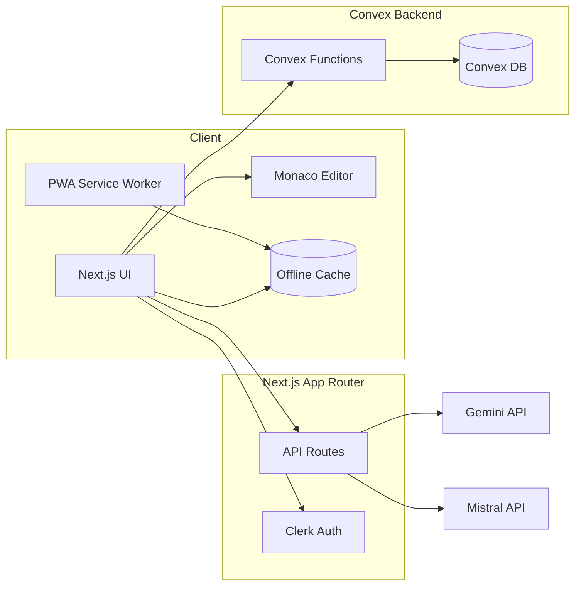
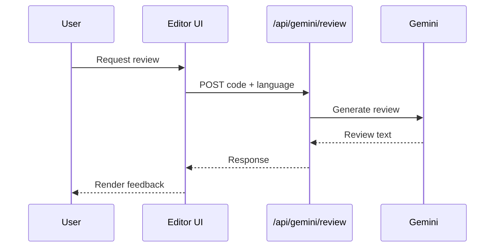
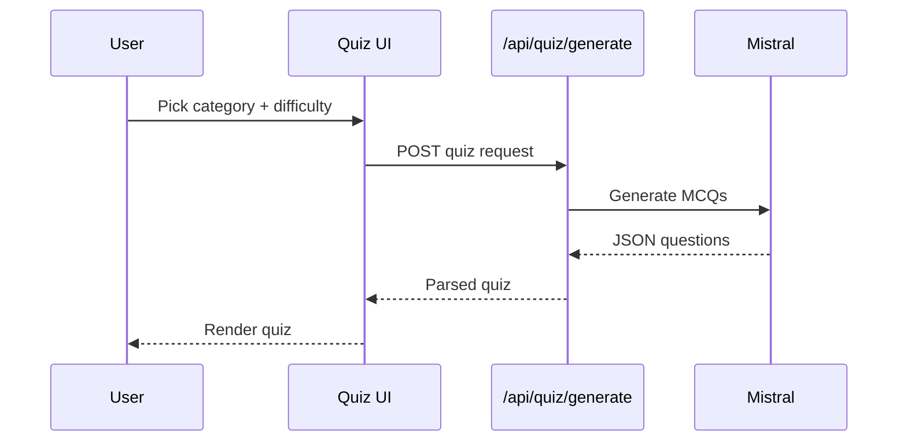

<h1 align="center">ZitaCode</h1>
<p align="center">
  A fast, multi-language coding playground with AI tools, snippets, and quizzes.
</p>

<p align="center">
  <a href="https://dub.sh/ZitaCode">Live demo</a> ·
  <a href="#features">Features</a> ·
  <a href="#how-it-works">How it works</a> ·
  <a href="#tech-stack">Tech Stack</a> ·
  <a href="#getting-started">Getting Started</a>
</p>

<p align="center">
  
</p>

> **Status:** Work in Progress

---

## What is ZitaCode?

ZitaCode is a developer-focused playground where you can write code in multiple languages, get AI feedback, and save/share snippets. It’s designed to be fast and clean, with a modern stack and a simple flow from typing to results.

---

## Features

- **Monaco-powered editor** with language presets and themes.
- **AI code review** via **Gemini**.
- **AI quiz generation** via **Mistral**.
- **Snippet sharing** with public URLs.
- **Buckets** to organize saved snippets.
- **Authentication** with **Clerk**.
- **Convex** backend for data + server functions.
- **PWA-ready** offline caching (`next-pwa`).

---

## How it works

### System architecture


### AI code review flow (Gemini)


### Quiz generation flow (Mistral)


---

## Tech Stack

<p align="center">
  
</p>

- **Next.js 16** (App Router)
- **React 19**
- **TypeScript**
- **Tailwind CSS**
- **Monaco Editor**
- **Convex**
- **Clerk Auth**
- **Gemini AI** + **Mistral AI**
- **PWA** (`next-pwa` + Workbox)

---

## Supported Languages

<p align="center">
  
  
  
  
  
  
  
  
  
  
  
</p>

> Language metadata includes **Piston runtime** versions for each language.

---

## Getting Started

### Prerequisites
- Node.js (LTS recommended)
- npm

### Install
```/dev/null/commands.sh#L1-2
npm install
npm run dev
```

### Environment Variables
Create a `.env.local` file with the following keys:
```/dev/null/.env.local#L1-5
NEXT_PUBLIC_CONVEX_URL=
NEXT_PUBLIC_CLERK_PUBLISHABLE_KEY=
CLERK_WEBHOOK_SECRET=
GEMINI_API_KEY=
MISTRAL_API_KEY=
```

### Scripts
```/dev/null/commands.sh#L1-4
npm run dev
npm run build
npm run start
npm run lint
```

---

## Security Notes

- Never commit real API keys to Git. `.env*` is ignored by default.
- If a key is exposed, rotate it immediately and rewrite history if needed.

---

## Inspiration

- Reference: https://youtu.be/fGkRQgf6Scw?si=sJ1ttB7TAOrcUx3u
